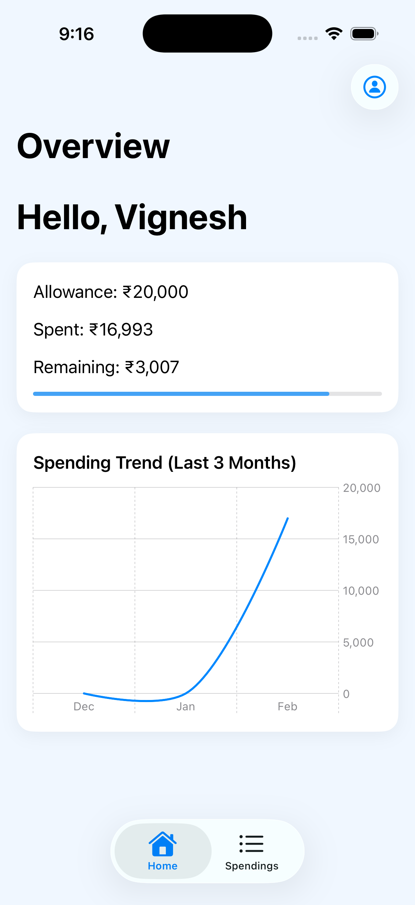
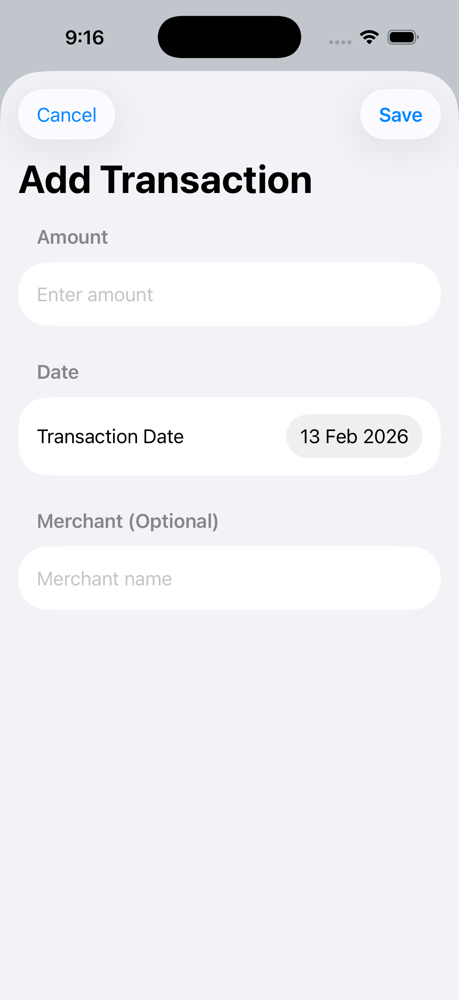
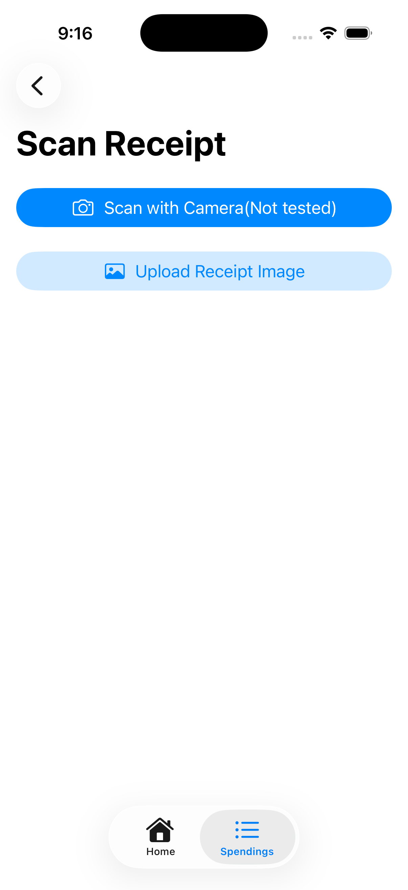
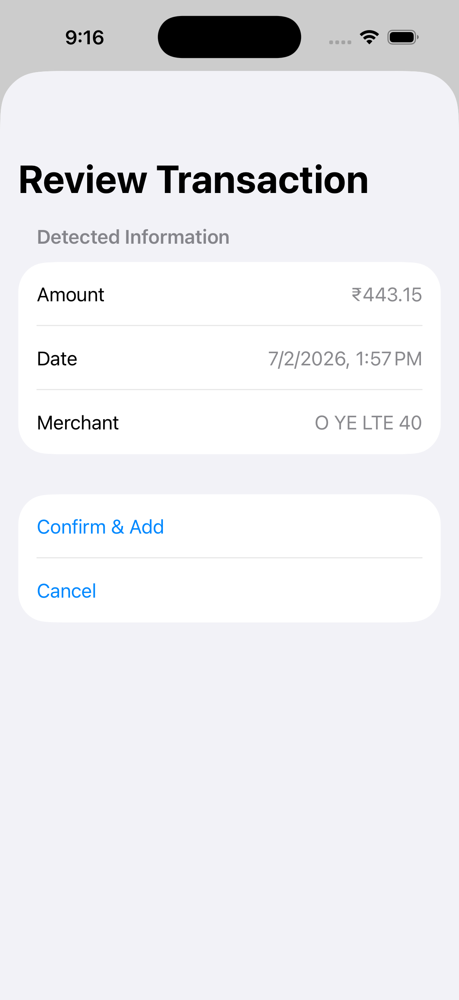

# 💰 ExpenseManager

A modern iOS expense management application built with SwiftUI and SwiftData, featuring intelligent OCR-based receipt scanning and duplicate detection.

## 📱 Features

### Core Functionality
- **Manual Transaction Entry**: Quick expense logging with amount, date, and merchant
- **OCR Receipt Scanning**: Extract transaction details from receipt photos using Vision framework
- **Smart Duplicate Detection**: Time-windowed deduplication based on source reliability
- **Budget Tracking**: Set monthly allowances and monitor spending progress
- **Spending Analytics**: 3-month trend visualization with interactive charts

### Technical Highlights
- **SwiftData Persistence**: Modern declarative data modeling with automatic migrations
- **Async/Await Concurrency**: Non-blocking OCR processing and image handling
- **Multi-Strategy Parsing**: Robust receipt parsing with 4-tier fallback logic
- **Source-Aware Validation**: Different duplicate detection windows for OCR vs manual entry

## 🏗️ Architecture

### Design Patterns
- **MVVM with SwiftUI**: Views observe models via `@Query` and `@Environment`
- **Service Layer**: Business logic isolated from UI (testable, reusable)
- **DTO Pattern**: `RawTransaction` separates unvalidated input from persisted `Transaction`
- **Strategy Pattern**: OCR parser uses multiple extraction strategies with fallbacks

## 🔄 Data Flow

### OCR Receipt/Camera Processing
```
┌─────────────┐
│ User Selects│
│   Receipt/  |
| Upload pic  | 
│             |
└──────┬──────┘
       │
       ▼
┌─────────────────────┐
│  Resize to 1024px   │  ← Performance optimization
│  (CameraView/       │
│   ScanReceiptView)  │
└──────┬──────────────┘
       │
       ▼
┌─────────────────────┐
│   OCRService        │  ← Vision framework
│   .recognizeText()  │    (VNRecognizeTextRequest)
└──────┬──────────────┘
       │
       ▼ Raw text
┌─────────────────────┐
│   OCRParser.parse() │  ← Multi-strategy extraction:
│                     │    1. "Paid" keyword search
│   • Amount: ₹450    │    2. "Total" keyword search
│   • Date: Feb 7     │    3. Regex pattern matching
│   • Merchant: ...   │    4. Fallback to last ₹ line
└──────┬──────────────┘
       │
       ▼ RawTransaction
┌─────────────────────┐
│  OCRReviewView      │  ← User verification
│  (Shows extracted   │
│   data for confirm) │
└──────┬──────────────┘
       │ User confirms
       ▼
┌─────────────────────────────────┐
│ TransactionIngestionService     │
│                                 │
│ 1. Validate amount & date       │
│ 2. Normalize merchant name      │
│ 3. Check duplicates:            │
│    - Same merchant (normalized) │
│    - Same amount                │
│    - Within time window:        │
│      • OCR: ±10 min             │
│      • Manual: ±3 min           │
│      • Bank: ±1 min             │
│                                 │
│ 4. Insert into SwiftData        │
└──────┬──────────────────────────┘
       │
       ▼
┌─────────────────────┐
│   SwiftData DB      │  
│   Transaction saved │
└──────┬──────────────┘
       │
       ▼
┌─────────────────────┐
│  UI Auto-Updates    │ 
│  • OverviewView     │
│  • TransactionList  │
└─────────────────────┘
```

### Manual Entry Flow
```
User Input → AddTransactionView → TransactionIngestionService
                                   ├─ Validation
                                   ├─ Duplicate Check
                                   └─ SwiftData Insert → UI Update
```

## 📊 Features Deep Dive

### 💰 Budget Tracking (Overview)

The Overview screen provides real-time monitoring of monthly spending against a user-defined allowance.

#### Core Calculations

- **Current Spend** – Sum of all transactions from the current calendar month
- **Remaining Budget** – Monthly allowance − current spend
- **Progress** – Percentage of budget consumed (capped at 100% for display)

#### Visual Indicators

- 🔵 **Blue progress bar** — Normal spending (< 90%)
- 🔴 **Red progress bar** — Warning state (≥ 90%)

This color-coded system allows users to instantly identify when they are nearing or exceeding their monthly budget.

### 📸 Overview Screen

---

### 📈 3-Month Spending Trend

The app uses SwiftUI Charts to visualize historical spending patterns.

#### Implementation Highlights

- **Chart Type**: Line chart
- **Interpolation**: Catmull-Rom smoothing for visually clean curves
- **Data Aggregation**:
  - Filters transactions month-wise
  - Calculates total spend for each of the last 3 months
- **Automatic Scaling**: Y-axis adjusts dynamically based on spending range

This helps users identify trends and compare spending patterns over time.

---

### 🔒 Data Validation

To ensure data integrity, the app enforces strict validation before saving transactions.

#### 1️⃣ Amount Validation

- Must be a valid `Double`
- Must be greater than `0`
- Rejects zero, negative, or non-numeric input
- Displays error alert for invalid entries

#### 2️⃣ Date Validation

- Must convert into a valid `Date`
- OCR dates validated against multiple formats
- Invalid or unparseable dates are rejected
- Transactions without valid dates cannot be saved

#### 3️⃣ Merchant Validation

- Merchant field is **optional**
- OCR-extracted merchant names are filtered to remove noise
- Invalid extractions are discarded during parsing

### 📸 Transaction Entry Screen



---

### 🧾 OCR Merchant Extraction Logic

To extract clean merchant names from receipts, the app uses heuristic filtering.

#### Applied Filters

##### 1️⃣ Length Check
- Skips empty lines or lines with < 2 characters

##### 2️⃣ Keyword Filtering
- Excludes common receipt terms:
  - `order`, `bill`, `receipt`, `invoice`, `tax`, `gst`, `total`, `paid`
- Case-insensitive matching

##### 3️⃣ Currency Detection
- Skips lines containing `₹` or `Rs`
- Prevents amount lines from being misclassified

##### 4️⃣ Digit Ratio Analysis
- Excludes lines where >30% of characters are digits
- Filters out order IDs, phone numbers, invoice numbers

#### Selection Strategy

After filtering, the **first "clean" line** is selected as the merchant name, based on the assumption that merchant names typically appear at the top of receipts.

### 📸 OCR Extraction Example

---

## 🚀 Future Enhancements

### Planned Features
- [ ] **Bank Integration**: Integrate Plaid/Yodlee/TrueLayer APIs for automatic transaction syncing from bank accounts, credit cards, and UPI. This will enhance data completeness, enable auto-categorization, and reduce manual entry effort.
- [ ] **LLM-Powered OCR**: Replace regex-based parsing with LLM API calls (Claude Haiku, GPT-4o Mini, or Gemini Flash) to intelligently extract merchant name, date, amount, and line items from receipt text with higher accuracy.
- [ ] **Categories & Tags**: Auto-categorize transactions (Food, Transport, Entertainment) using API-provided data or LLM inference.
- [ ] **Search & Filters**: Find transactions by merchant, date range, amount, or category.
- [ ] **Export Reports**: Generate CSV/PDF expense reports for tax filing and reimbursements.


## 📱 Requirements

- **iOS**: 17.0+
- **Xcode**: 15.0+
- **Swift**: 5.9+

### Frameworks Used
- **SwiftUI**: Declarative UI framework
- **SwiftData**: Persistence layer
- **Vision**: OCR text recognition
- **Charts**: Data visualization
- **PhotosUI**: Image picker integration

## 🏃 Getting Started

### Running the App
1. Clone repository
2. Open `ExpenseTracker.xcodeproj` in Xcode
3. Select target device/simulator (iOS 17+)
4. Build and run (⌘R)

### First Launch
1. Create user profile (name + monthly allowance)
2. Add transaction manually or scan receipt
3. View dashboard for spending summary

